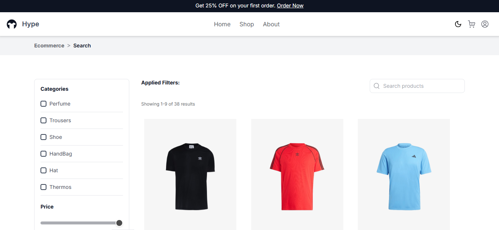

# 🛍️ Hype

**Hype** is an eCommerce platform for clothing developed as part of the **AWS REACT DEZ24 CHALLENGE 03**. The project allows users to browse products, add items to their cart, complete purchases, and track their orders. Additionally, it features authentication via **Clerk**, dark mode support, and an admin panel for managing products.



## 🚀 Tecnologias Usadas

- React + Vite
- TypeScript
- Tailwind CSS
- Redux (gestão de estado)
- Clerk (autenticação)
- Axios (requisições HTTP)
- JSON Server (banco de dados simulado)

## 📌 Funcionalidades

### 🛒 Usuário
- ✔ Registro/Login via e-mail/senha ou Google
- ✔ Recuperação de senha via Clerk
- ✔ Navegação, busca e filtragem de produtos
- ✔ Adicionar produtos ao carrinho e finalizar compras
- ✔ Histórico de pedidos na conta do usuário
- ✔ Página "Sobre" com informações do desenvolvedor
- ✔ Modo escuro

### 🔧 Admin
- ✔ CRUD de produtos (Criar, Editar, Deletar)

### 🔑 Acesso de Admin (Testes)
Para testar a área administrativa, utilize as seguintes credenciais:
- **E-mail:** hypeawsd3@gmail.com
- **Senha:** Admin@01

## 🎨 Layout
O design do projeto foi baseado no modelo do Figma. Você pode visualizar o layout no [Figma](https://www.figma.com/design/5UZJJ8ov2jTbD1QEZoLtMz/Ecommerce-(Community)?node-id=1674-2029&p=f&t=slGHJGYsbtLH2UYK-0).

## 🚀 How to Run the Project

1. Clone the repository:
   ```sh
   git clone https://github.com/vanleybasso/aws_react_dez24_d03.git

   ```
2. Access the project directoryo:
   ```sh
   cd aws_react_dez24_d03
   ```
3. Install dependencies:
   ```sh
   npm install
   ```
4. Start the JSON Server:
   ```sh
   npm run server
   ```
5. Start the project:
   ```sh
   npm run dev
   ```
6. Visit the app:
   ```
   localhost:5173
   ```
   
## 📜 Acknowledgments

I would like to thank Compass UOL and the instructors who provided this project, as they were crucial to our professional growth and provided us with a valuable learning experience.

## 🔗 Useful Links

- [GitHub Repository](https://github.com/vanleybasso/aws_react_dez24_d03)
- [Figma Layout](https://www.figma.com/design/5UZJJ8ov2jTbD1QEZoLtMz/Ecommerce-(Community)?node-id=1674-2029&p=f&t=slGHJGYsbtLH2UYK-0)
- [LinkedIn](https://www.linkedin.com/in/vanleybasso)

---

I hope you enjoyed the project! 🚀
